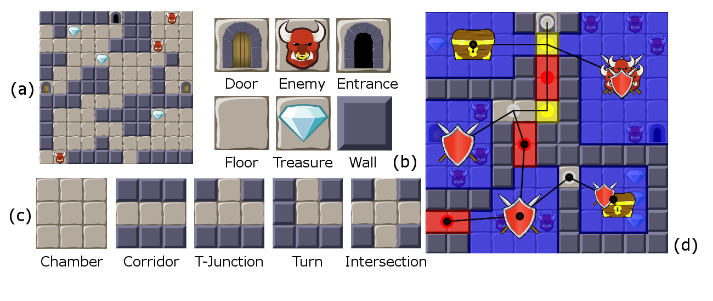

# Eddy



This is Eddy, the Evolutionary Dungeon Designer. Treat it well, and it will
prove to be a good friend.

## How to use

**Clone the repo and import it as a Maven project**. Everything should work
out of the box then. It is also possible to build a stand-alone executable JAR
file by running the following:

```
mvn clean install package
```

### Prerequisites

Eddy runs on Java SE 8u40 or newer, and uses JavaFX.

# Related Publications

<details>
<summary> <b> [1] </b> Baldwin, A., Dahlskog, S., Font, J.M., Holmberg, J., "Mixed-initiative procedural generation of dungeons using game design patterns," 
In: Proc. IEEE Conf. Computational Intelligence and Games (CIG). pp. 25–32 (2017) </summary>
<br>

```
@InProceedings{Baldwin2017-MI,
  author    = {Baldwin, Alexander and Dahlskog, Steve and Font, Jose M. and Holmberg, Johan},
  title     = {Mixed-initiative procedural generation of dungeons using game design patterns},
  booktitle = {Proc. IEEE Conf. Computational Intelligence and Games (CIG)},
  year      = {2017},
  pages     = {},
}
```
</details>

<br>

<details>
<summary> <b> [2] </b> Baldwin, A., Dahlskog, S., Font, J.M., Holmberg, J., "Towards pattern-based mixed-initiative dungeon generation," 
In: Proceedings of the 12th International Conference on the Foundations of Digital Games. pp. 74:1–74:10. FDG ’17, ACM, New York,
NY, USA (2017)</summary>
<br>

```
@InProceedings{Baldwin2017-patternBased,
  author    = {Baldwin, Alexander and Dahlskog, Steve and Font, Jose M. and Holmberg, Johan},
  title     = {Towards Pattern-based Mixed-initiative Dungeon Generation},
  booktitle = {Proceedings of the 12th International Conference on the Foundations of Digital Games},
  year      = {2017},
  series    = {FDG '17},
  pages     = {},
  address   = {New York, NY, USA},
  publisher = {ACM},
  acmid     = {3110572},
  articleno = {74},
}
```
</details>

<br>

<details>
<summary> <b> [3] </b> Alvarez,  A.,  Dahlskog,  S.,  Font,  J.,  Holmberg,  J.,  Johansson,  S., "Assessing  aesthetic criteria in the evolutionary dungeon designer," 
In: Proceedings of the 13th International Conference on the Foundations of Digital Games. FDG ’18 (2018))</summary>
<br>

```
@InProceedings{Alvarez2018-aestheticCriteria,
  author    = {Alvarez, Alberto and Dahlskog, Steve and Font, Jose and Holmberg, Johan and Johansson, Simon},
  title     = {Assessing Aesthetic Criteria in the Evolutionary Dungeon Designer},
  booktitle = {Proceedings of the 13th International Conference on the Foundations of Digital Games},
  year      = {2018},
  series    = {FDG '18}
}
```
</details>

<br>

<details>
<summary> <b> [4] </b> Alvarez, A., Dahlskog, S., Font, J., Holmberg, J., Nolasco, C.,Osterman, A., "Fostering creativity in the mixed-initiative evolutionary dungeon designer,"
In: Proceedings of the 13th International Conference on the Foundations of Digital Games. FDG ’18 (2018)</summary>
<br>

```
@InProceedings{Alvarez2018-fosteringCreativity,
  author    = {Alvarez, Alberto and Dahlskog, Steve and Font, Jose and Holmberg, Johan and Nolasco, Chelsi and \"{O}sterman, Axel},
  title     = {Fostering Creativity in the Mixed-initiative Evolutionary Dungeon Designer},
  booktitle = {Proceedings of the 13th International Conference on the Foundations of Digital Games},
  year      = {2018},
  series    = {FDG '18}
}
```
</details>

<br>

<details>
<summary> <b> [5] </b> Alvarez, A., Dahlskog, S., Font, J., Togelius, J., "Empowering quality diversity in dungeon design with interactive constrained map-elites,"
In: 2019 IEEE Conference on Games (CoG). pp. 1–8 (2019)</summary>
<br>

```
@InProceedings{alvarez2019-empowering,
author={Alvarez, Alberto and Dahlskog, Steve and Font, Jose and Togelius, Julian},
booktitle={2019 IEEE Conference on Games (CoG)},
title={Empowering Quality Diversity in Dungeon Design with Interactive Constrained MAP-Elites},
year={2019}
}
```
</details>

<br>

<details>
<summary> <b> [6] </b> Alvarez, A., Font, J., "Learning the Designer’s Preferences to Drive Evolution,"
In: Applications of Evolutionary Computation. EvoApplications 2020. Lecture Notes in Computer Science, vol 12104.</summary>
<br>

```
@InProceedings{Alvarez2020-DesignerPreference,
author="Alvarez, Alberto
and Font, Jose",
editor="Castillo, Pedro A.
and Jim{\'e}nez Laredo, Juan Luis
and Fern{\'a}ndez de Vega, Francisco",
title="Learning the Designer's Preferences to Drive Evolution",
booktitle="Applications of Evolutionary Computation",
year="2020",
series = "Lecture Notes in Computer Science",
volume = "12104",
publisher="Springer International Publishing",
address="Cham",
pages="431--445",
isbn="978-3-030-43722-0"
}
```
</details>

<br>

<details>
<summary> <b> [7] </b> Alvarez, A., Dahlskog, S., Font, J., Togelius, J., "Interactive constrained map-elites: Analysis and evaluation of the expressiveness of the feature dimensions,"
Preprint available: https://arxiv.org/abs/2003.03377.</summary>
<br>

```
@article{Alvarez2020-ICMAPE,
title={Interactive Constrained MAP-Elites: Analysis and Evaluation of the Expressiveness of the Feature Dimensions},
author={Alberto Alvarez and Steve Dahlskog and Jose Font and Julian Togelius},
year={2020},
journal={Submitted to IEEE Transactions on Games},
note ={Preprint available: https://arxiv.org/abs/2003.03377},
publisher={IEEE}
}
```
</details>

<br>

<details>
<summary> <b> [8] </b> Alvarez, A., Font, J., Togelius, J., "Designer modeling through design style clustering," 
Preprint available: https://arxiv.org/abs/2004.01697.</summary>
<br>

```
@article{alvarez2020-designerpersonas,
author={A. {Alvarez} and J. {Font} and J. {Togelius}},
journal={Submitted to IEEE Transactions on Games},
title     = {Designer Modeling through Design Style Clustering},
year={2020},
note ={Preprint available: https://arxiv.org/abs/2004.01697},
publisher={IEEE}
}
```
</details>

<br>

<details>
<summary> <b> [9] </b> A. Flodhag, S. Tolinsson, A. Alvarez, and J. Font, “To make sense of dungeons: Developing procedural narrative for edd with the help of macro patterns,” 
In: Extended Abstracts of the Annual Symposium on Computer-Human Interaction in Play Companion Extended Abstracts, 
CHI PLAY ’20 Extended Abstracts, (New York, NY, USA), ACM, 2020.
</summary>
<br>

```
@InProceedings{flodtol2020-WIPMakeSenseDungs,
  Author = {Flodhag, Alexander and Tolinsson, Simon and Alvarez, Alberto and Font, Jose},
  publisher = {ACM},
address = {New York, NY, USA},
booktitle = {Extended Abstracts of the Annual Symposium on Computer-Human Interaction in Play Companion Extended Abstracts},
numpages = {4},
series = {CHI PLAY '20 Extended Abstracts},
  Year = {2020},
  Title = {To make sense of dungeons: Developing procedural narrative for EDD with the help of macro patterns}
}
```
</details>


